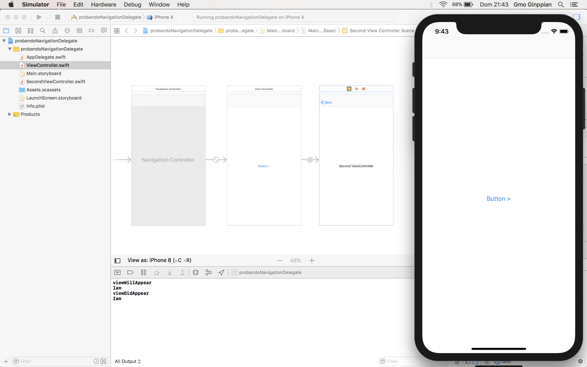
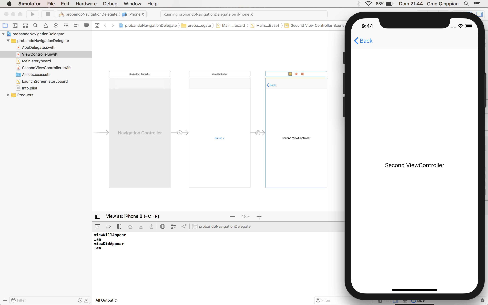
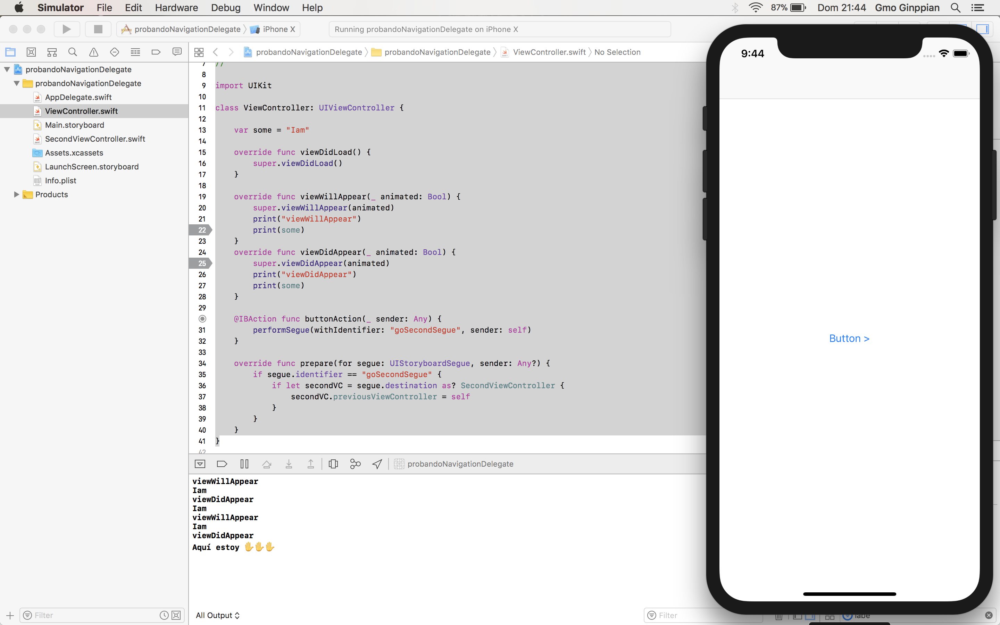

Back Action with UINavigationControllerDelegate
===

## Definición

<p align="justify">
	Cuando queremos pasar algun tipo de variable a una vista en el preciso momento que presionamos el <b>'boton de Back <'</b> podemos usar un protocolo creado por nos otros y delegar lo a través del segue, sino queremos crear lo podemos usar <i>UINavigationControllerDelegate</i>.
</p>

## Code

### Primera Vista

```swift
//
//  ViewController.swift
//  probandoNavigationDelegate
//
//  Created by Gmo Ginppian on 14/01/18.
//  Copyright © 2018 BUAP. All rights reserved.
//

import UIKit

class ViewController: UIViewController {

    var some = "Iam"
    
    override func viewDidLoad() {
        super.viewDidLoad()
    }

    override func viewWillAppear(_ animated: Bool) {
        super.viewWillAppear(animated)
        print("viewWillAppear")
        print(some)
    }
    override func viewDidAppear(_ animated: Bool) {
        super.viewDidAppear(animated)
        print("viewDidAppear")
        print(some)
    }

    @IBAction func buttonAction(_ sender: Any) {
        performSegue(withIdentifier: "goSecondSegue", sender: self)
    }
    
    override func prepare(for segue: UIStoryboardSegue, sender: Any?) {
        if segue.identifier == "goSecondSegue" {
            if let secondVC = segue.destination as? SecondViewController {
                secondVC.previousViewController = self
            }
        }
    }
}
```

* Si pusieramos un par de *break points* nos dariamos cuanta que antes de entrar a *willShow* de *UINavigationControllerDelegate* ejecuta el *viewWillAppear* del *viewController* esto es porque en el *viewWillAppear* va todo tipo de transición gráfica, y en el *viewDidAppear* se hace el consumo de variables (un servicio o un calculo), de preferencia.

* Para crear el *Segue* seleccionamos el ViewController (en la cajita amarilla de arriba) y hacemos *drag and drop con la flecha azul* hacia SecondViewController

### Segunda Vista

```swift
//
//  SecondViewController.swift
//  probandoNavigationDelegate
//
//  Created by Gmo Ginppian on 14/01/18.
//  Copyright © 2018 BUAP. All rights reserved.
//

import UIKit

extension SecondViewController: UINavigationControllerDelegate {
    public func navigationController(_ navigationController: UINavigationController, willShow viewController: UIViewController, animated: Bool) {
    
        if viewController == self.previousViewController {
            if let firstVC = viewController as? ViewController {
                firstVC.some = "Aquí estoy ✋✋✋"
            }
        }
    }
}

class SecondViewController: UIViewController {
    
    var previousViewController: ViewController?
    
    required init?(coder aDecoder: NSCoder) {
        super.init(coder: aDecoder)
    }
    
    // MARK: - Life Cycle
    
    override func viewDidLoad() {
        super.viewDidLoad()
        
        self.navigationController?.delegate = self
    }
}
```

En la *extension* implementamos el protocolo, es importante poner un *required init*

<p align="center">
	
</p>

<p align="center">
	
</p>

<p align="center">
	
</p>


## Fuente

* <a href="https://stackoverflow.com/questions/27713747/execute-action-when-back-bar-button-of-uinavigationcontroller-is-pressed">Stack Overflow</a>

* <a href="http://blog.rinatkhanov.me/ios/transitions.html">Custom Animations</a>